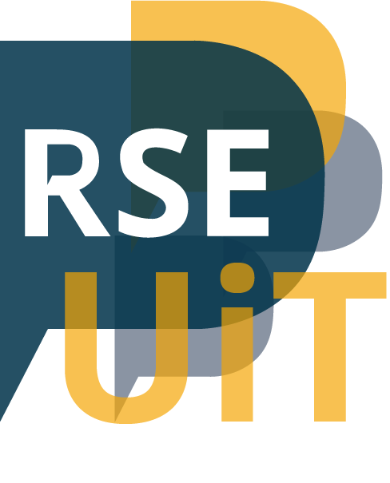

class: center, middle, gray-background

# #ResearchSoftwareHour

## [Radovan Bast](https://fosstodon.org/@radovan), UiT The Arctic University of Norway

&nbsp;

Text: CC-BY 4.0

---

# https://researchsoftwarehour.github.io/

---

# https://researchsoftwarehour.github.io/

- With **Richard Darst** (Aalto, Finland) and **Anne Fouilloux** (now Simula Research Laboratory, Norway)

- .emph[Live recorded] (YouTube) and streamed (Twitch)

- Show "skills typically picked up via informal networks"

## Remember how you learned about tab completion?

---

# Past topics

.left-column50[
- GitHub
- Computers for research
- Git conflicts
- Open broadcaster software
- Data preparation and release
- Shells and terminals
- Zen of scientific computing
- Rust for science
- Debugging
- Containers
]

.right-column50[
- Cluster etiquette
- git-annex
- Conda
- Reproducibility
- Command line arguments
- Packaging
- Testing
- Workflows
- Dependencies
- Code review
]

---

# Lessons learned

- We wanted big live audience but we did not sufficiently advertise

- No shortage of topics/ideas

- It was an evening and weekend thing

- It is too scary to join with something unfinished
> "Watchers can take part by suggesting ideas, .emph[contribute code] or problems
> to discuss on stream, or even joining to directly .emph[be a part of the show]."

- It is effective to have the videos and refer to them when helping
  researchers

---

# Future: We will probably restart!

- Short sessions

- Idea: **"What do you know now that you wish somebody taught you earlier?"** (guests or survey)

- In each episode we would discuss one of those

- Live record during work time (1 hour preparation time)

- Do better at social media and outreach

- Streamline the production to have more time for content

- **Please get in touch if you find this interesting**: <radovan.bast@uit.no>
